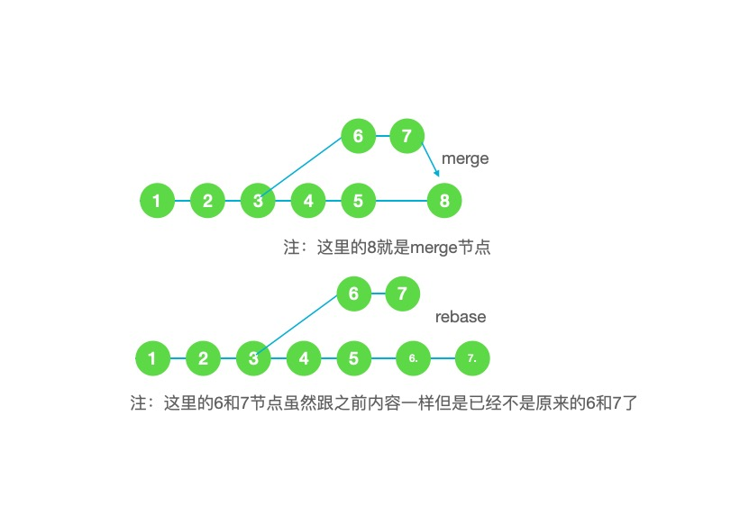

### Git的简介与GitFlow工作流程分享

#### Git的简介

GIT,全称是分布式版本控制系统。顾名思义，主要用版本控制管理的一套工具。这里有个词有点意思，叫做分布式。与之对应的是集中式，典型代表svn。

那么分布式与集中式的主要区别是什么呢？

首先聊一聊集中式，集中式顾名思义版本库是集中放在中央服务器的。因为工作不在中央服务器而是我们自己的电脑，所以都需要先从中央服务器获得最新的版本，然后开始干活，干完活后再把活推到中央服务器。所以从这里就可以看出2个问题。1.必须联网，因为需要连接到中央服务器才能做事情，连不上就尬住了。

2.需要频繁更新服务器信息（尤其是在提交之前），因为可能是多人在干活的，服务器的内容在不断更新。

然后就是分布式，分布式每个人的电脑上都有完整的库，所以不需要联网你就可以干任何事情。但是一般分布式也有一台“中央服务器”但是他的作用仅仅是用来方便大家交换修改。没有也是可以继续干活的，只是交换不便而已。 退一步讲，这里的“中央服务器”跟大家的电脑里的库是同级别的。

从这里就可以看出现在svn慢慢的少了，git越来多的一些端倪了。（ps:可以想想为什么手炒clone这么大，可以在想想为什么clone一般默认只clone一个master分支）

题外话：git是有什么语言开发的？（C）

接下来聊一聊git的里存在的几个状态：工作区，版本库（暂存区，commit）


所以我们的改动流向就是工作区--通过add-->暂存区--通过commit-->本地节点--通过push-->远端节点

#### Git的常用命令

##### 本地查看

``git status``  查看本地当前分支文件状态 

``git diff``  查看本地当前分支修改(注意是未暂存的修改)。 *git diff README* 查看指定文件的修改

``git log`` 查看当前分支的历史提交情况

##### 本地基础操作

``git add <file>`` 暂存工作区的修改到暂存区 *git add .*所有文件提交暂存区

``git reset HEAD <file>``回退暂存区的修改到工作区  不加相应的file就是全部重置

``git commit`` 将暂存区的修改提交到本地仓库  *git commit -m "this is a commit"*  一般需要增加一个说明哦，养成良好习惯。

``git reset <commit id>``重置当前分支到commit id指定的提交，保留源码

``git reset --hard <commit id>``重置当前分支到指定提交，不保留源码

``git reflog`` 列出版本修改历史，通常重置版本后要回到未来提交版本时，用该命令获取到对应提交的版本号**慎用，容易晕**

``git stash `` 把工作区和暂存区的内容保存起来,*git stash pop*把保存的内容拿出来。*git stash list*查看暂存列表（常用在代码要写在A分支，发现现在在B，就可以这么搞，也可以用于突然要试验代码了）

``git checkout -- <file>`` 撤销工作区指定文件的修改*git checkout -- .*全部撤销

``git cherry-pick <commit id>``获取指定id的commit提交到当前分支

##### 本地分支操作

``git branch`` 说明：列出本地分支*git branch -r*列出远程分支

``git branch <分支名>`` 创建新的分支

``git checkout <分支名>`` 切换到指定分支

``git branch -d <分支名>`` 删除指定分支 

``git merge <分支名>`` 合并指定分支到当前分支

##### 远程操作

``git clone <远程仓库路径>`` 克隆远程仓库到本地 

``git checkout -b <本地分支名> origin/<远程分支名>`` 检出远程分支到本地

``git push origin <远程分支名>`` 推送当前本地分支到远程分支 note：若远程不存在相应的分支时会自动创建 

``git push --force`` 本地分支强行覆盖远端分支

``git push origin --delete <远程分支名>`` 删除远程分支

``git pull origin <远程分支名>`` 拉取远程分支到当前本地分支

##### 标签

``git tag``列出所有标签

``git tag <tagname> <commit id>``指定在某个提交上打标签

``git push origin --tags``推送所有本地未推送的标签到远程

``git tag -d <tagname>``删除本地标签

``git push origin :refs/tags/<tagname>``删除远程标签

**人与动物最大的区别是 制造和使用工具。**所以最后我强烈推荐一个工具**Sourcetree**。这个工具最大的特点就是图形化。把所有的节点分支展示的十分清楚，一些基本的命令也可以进行图像化操作处理。

对于这个工具，我建议简单的命令都使用这个工具。而复杂的操作还是通过命令来精准控制防止出错。

#### merge与rebase

merge前面已经提到过了，下面简单介绍下rebase。rebase这东西就很暴力了,简单的说就是设置一部分节点重新处理提交，简直可以说是可以为所欲为。

``git rebase -i <commit id>``可以把这个commit id前面的节点重新处理处理方式如下：

```bash
# p, pick = use commit (保留提交，什么都不改)
# r, reword = use commit, but edit the commit message (保留提交，重写commit message)
# e, edit = use commit, but stop for amending (用于重写commit内容或拆分提交)
# s, squash = use commit, but meld into previous commit (与上一个提交合并，并能重写commit message)
# f, fixup = like "squash", but discard this commit's log message (与上一个提交合并，并保留上一个提交的commit message)
# x, exec = run command (the rest of the line) using shell 
# b, break = stop here (continue rebase later with 'git rebase --continue') 暂停
# d, drop = remove commit (移除提交)
# l, label <label> = label current HEAD with a name
# t, reset <label> = reset HEAD to a label
# m, merge [-C <commit> | -c <commit>] <label> [# <oneline>]
# .       create a merge commit using the original merge commit's
# .       message (or the oneline, if no original merge commit was
# .       specified). Use -c <commit> to reword the commit message.
```

``git rebase <upstream>``将当前分支变基到upstream节点，若upstream为分支则变基到该分支的头节点。

``git rebase --continue``rebase的过程中出现冲突，解决后执行完成变基

``git rebase --abort``rebase的过程中出现冲突，放弃变基



这个图就很明白的展示了merge和rebase的区别。使用merge可以把每个变动都记录下来，包括节点的提交时间等等。而rebase的好处在于分支节点的干净。

一般**对尚未推送或分享给别人的本地修改执行变基操作清理历史，对已推送至别处的提交执行合并操作**。当然这也不绝对，也看个人使用喜好。（我个人更喜欢rebase,保持分支整洁。）

#### GitFlow工作流程

其实常见的工作流也有很多比如中心化工作流（只有一个分支，svn类型），在提交时候只用rebase，tag记录分支清晰，future分支工作流（相比较之前的中心化增加future分支，便于多任务开发提高效率。）而这里要讲的gitflow是一个更完整的工作流，比较适合较大的项目，下面一张图可以解释这个流：


图中常驻分支为：develop、master。而其他分支只会在其需要时短暂存在。develop为日常开发分支，master为线上版本记录分支。**记得打上tag（标签），记得打上tag，记得打上tag！**重要的事情说三遍。

feature分支是当你遇到不知道哪个版本，或者是已知不在当前版本上的任务时开辟的，release分支是大家把本期任务做完提交测试时候开辟的。hotfixes分支是处理紧急bug存在的。

从图中可以看出理论上master和dev是不会重合的（虽然很多时候节点内容一致，但因为提交时间不同所以一般不会重合）。

#### 项目中的Git流程

考虑到项目的严谨性。我们一般也使用GitFlow工作流。但是稍有不同的是，我们一般master和dev分支是重合的（原因在于：我们的版本性比较强，出现线上问题一般也在下个版本修复）。 或者说我们的develop分支更像一个常驻的future分支。但是在一定程度上又保留了（hotfixes）的可能性。当然这样的好处也就是分支看上去更少，更整洁。

当然如果项目人数少，版本严苛其实使用future工作流也没什么问题。（再复习这个工作流，理论上保留future分支和master分支，在future分支上完成所有开发，测试没问题后合并到master，记录tag,遇到线上bug也是类似的处理方式。合并后future分支可以删除。）

